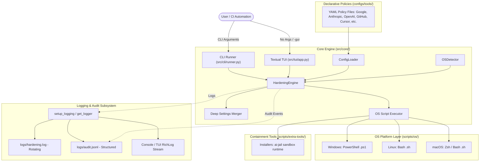

# System Architecture - Hardening IA

## 1. Overview

**Hardening IA** is an enterprise-grade, multi-platform framework designed to automate the configuration and enforcement of security controls (*hardening*) across AI-assisted development tools. It uniformly protects Command-Line Interfaces (CLIs), Integrated Development Environments (IDEs), and Autonomous Agentic systems.

The framework supports **Windows**, **Linux**, and **macOS**, providing:
- **Headless CLI Execution:** Designed for CI/CD pipelines, automated enterprise baselines, and provisioning scripts.
- **Interactive Terminal UI (TUI):** Built with [Textual](https://github.com/Textualize/textual) for human operators to inspect, select, and enforce policies with live feedback.
- **Declarative YAML Policies:** Extensible, versioned security definitions tailored to each vendor and tool.
- **End-to-End Structured Logging & Auditing:** Automated rotating logs (`logs/hardening.log`) and SIEM-ready structured audit records (`logs/audit.jsonl`).
- **Runtime Containment & Extra Tools:** Automated provisioning of agent sandboxes such as `ai-jail`.

---

## 2. Architecture Diagram



---

## 3. Directory Layout

```
hardening-ia/
├── docs/                               # Technical documentation and guides
│   ├── ARCHITECTURE.md                 # System architecture and execution flow
│   ├── HARDENING_GUIDELINES.md         # AI security threat model & defense pillars
│   ├── CONFIG_SPEC.md                  # YAML policy schema specification (v1.0)
│   └── tools/                          # Dedicated guides per vendor and tool
│       ├── google/antigravity/
│       ├── anthropic/claude-code/
│       ├── openai/codex/
│       ├── opencode/opencode/
│       ├── nousresearch/hermes-agent/
│       ├── qoder/qoder/
│       ├── github/copilot/
│       ├── anysphere/cursor/
│       ├── kilo/kilo-code/
│       ├── cline/cline/
│       ├── clinepass/clinepass/
│       ├── codebuddy/codebuddy/
│       ├── moonshot/kimi/
│       └── xai/grok/
│
├── configs/                            # Declarative YAML policies
│   └── tools/
│       ├── google/antigravity/hardening_policy.yaml
│       ├── anthropic/claude-code/hardening_policy.yaml
│       ├── openai/codex/hardening_policy.yaml
│       ├── opencode/opencode/hardening_policy.yaml
│       ├── nousresearch/hermes-agent/hardening_policy.yaml
│       ├── qoder/qoder/hardening_policy.yaml
│       ├── github/copilot/hardening_policy.yaml
│       ├── anysphere/cursor/hardening_policy.yaml
│       ├── kilo/kilo-code/hardening_policy.yaml
│       ├── cline/cline/hardening_policy.yaml
│       ├── clinepass/clinepass/hardening_policy.yaml
│       ├── codebuddy/codebuddy/hardening_policy.yaml
│       ├── moonshot/kimi/hardening_policy.yaml
│       └── xai/grok/hardening_policy.yaml
│
├── scripts/                            # Platform execution scripts
│   ├── os/
│   │   ├── windows/apply-hardening.ps1 # Windows PowerShell security scripts
│   │   ├── linux/apply-hardening.sh    # Linux Bash security scripts
│   │   └── macos/apply-hardening.sh    # macOS Zsh/Bash security scripts
│   └── extra-tools/                    # Security runtime tool installers
│       ├── windows/install-ai-jail.ps1
│       ├── linux/install-ai-jail.sh
│       └── macos/install-ai-jail.sh
│
├── src/                                # Application source code
│   ├── core/
│   │   ├── models.py                   # Data schemas & dataclasses
│   │   ├── logger.py                   # Rotating file and JSONL audit logging
│   │   ├── os_detector.py              # OS detection and path normalization
│   │   ├── config_loader.py            # YAML policy discovery & parser
│   │   └── engine.py                   # Deep merge & execution engine
│   ├── cli/
│   │   └── runner.py                   # Headless CLI runner with Rich tables
│   └── tui/
│       └── app.py                      # Modern interactive Textual TUI
│
├── logs/                               # Output log directory (.gitignored)
│   ├── hardening.log                   # Rolling execution logs
│   └── audit.jsonl                     # Structured JSONL security audit records
│
├── main.py                             # Unified application entrypoint
├── pyproject.toml                      # Package metadata and dependencies
├── requirements.txt                    # Python dependencies
├── .gitignore                          # Environment, venv, log, and OS exclusions
└── README.md                           # Quickstart and overview guide
```

---

## 4. Execution Lifecycle

1. **Initialization (`main.py`):**
   - Inspects CLI parameters. If `-gui` / `--gui` or zero arguments are supplied, initializes the interactive TUI (`src.tui.app`).
   - If action flags (`--list`, `--apply`, `--dry-run`, `--install-extra`, `--tool`) are detected, routes execution to `src.cli.runner`.

2. **Policy Discovery & Validation (`ConfigLoader`):**
   - Recursively parses YAML files from `configs/tools/<vendor>/<tool>/`.
   - Validates required fields, schema versioning, and OS path structures into `HardeningPolicy` dataclass instances.

3. **OS Platform Resolution (`OSDetector`):**
   - Identifies whether the current host is Windows, Linux, or macOS.
   - Expands environment variables (`%USERPROFILE%`, `%APPDATA%`, `~`) to canonical local filesystem paths.

4. **Policy Enforcement (`HardeningEngine`):**
   - **Deep Configuration Merge:** Safely loads existing JSON configuration files for the targeted tool, applies the hardened security overrides without overwriting unrelated user settings, and records detailed before/after diffs.
   - **OS Script Execution:** Runs native shell scripts (`apply-hardening.ps1` or `apply-hardening.sh`) to lock down directory ACLs (700 for directories, 600 for files) and configure global privacy environment variables (`DO_NOT_TRACK=1`, `CLAUDE_DISABLE_TELEMETRY=1`).
   - **Audit Record Generation:** Records an immutable audit event in `logs/audit.jsonl` with status, timestamp, tool name, and setting modifications.
