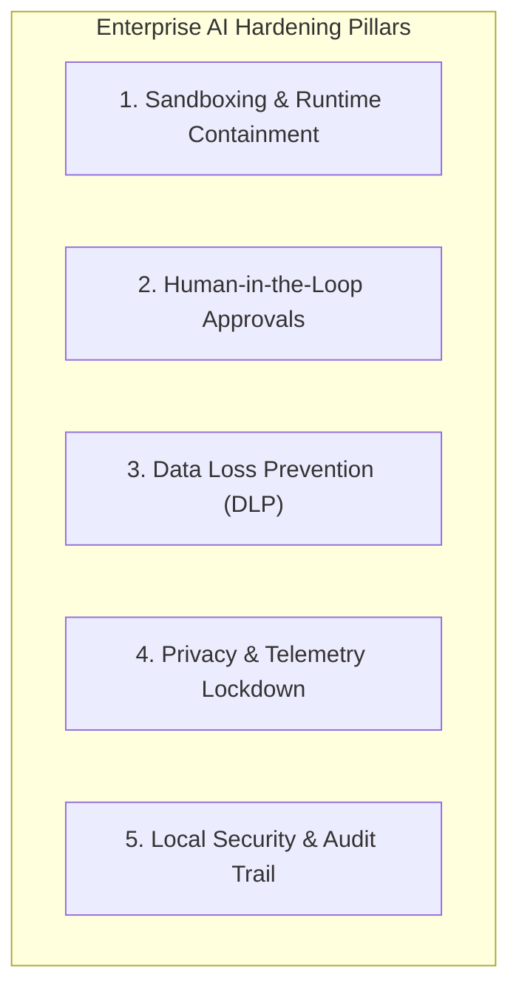

# Enterprise Hardening Guidelines for AI Development Tools

This document outlines the core security principles, threat model, and mitigation strategies implemented by the **Hardening IA** framework across Command-Line Interfaces (CLIs), Integrated Development Environments (IDEs), and Autonomous Agentic systems.

---

## 1. Threat Modeling & Risk Vectors

Modern AI-assisted development tools introduce distinct security surfaces that traditional developer tooling does not exhibit:

### 1.1 Autonomous Agent Overreach & Destructive Command Execution
- **Indirect Prompt Injection:** Adversarial instructions embedded within code comments, third-party libraries, git issues, or pull request descriptions can manipulate the LLM into executing malicious shell commands.
- **Unrestricted Terminal Access:** Agents operating with auto-approval flags enabled can execute destructive commands (`rm -rf`, disk wipes, mass repository overwrites, or unauthorized software installation).

### 1.2 Data Exfiltration & Secret Leakage (DLP)
- **Prompt Injection of Credentials:** Context collection features may inadvertently ingest local secrets (`.env`, `.aws/credentials`, `id_rsa`, `.kube/config`, database connection strings) and transmit them to external LLM endpoints.
- **Continuous Model Retraining:** Unconsented ingestion and telemetry transmission of proprietary intellectual property and source code fragments to third-party providers.

### 1.3 MCP (Model Context Protocol) & Plugin Escalation
- Unaudited MCP servers running on local sockets with broad capabilities (raw filesystem read/write, unrestricted HTTP requests, database access) can be hijacked by an agent following untrusted context.

### 1.4 Lack of Process Isolation & Unprivileged Execution
- AI tools executing directly on the developer's workstation without containerization or sandbox containment, inheriting full user or administrator privileges.

---

## 2. Hardening Pillars & Mitigation Strategies

### Pillar 1: Sandboxing & Runtime Containment
- **Policy:** AI tools capable of running arbitrary code must be constrained within a containment layer (e.g., `ai-jail`, Windows Sandbox, Docker containers, AppArmor/Firejail).
- **Enforcement:** Ensure `enforce_sandbox: true` and block unconstrained sandbox bypasses.

### Pillar 2: Human-in-the-Loop Approvals
- **Policy:** Destructive file operations, command execution, and network egress outside localhost must require explicit user approval.
- **Enforcement:** Disable auto-approval flags (`autoApprove: false`, `alwaysApproveResubmit: false`, `cursor.terminal.autoExecute: false`).

### Pillar 3: Data Loss Prevention (DLP) & Secret Protection
- **Policy:** Sensitive file patterns must be excluded from indexing and context aggregation.
- **Enforcement:** Global pattern exclusions for:
  - `**/.env*`
  - `**/*.pem`, `**/*.key`, `**/*.pfx`, `**/*.p12`
  - `**/*_rsa`, `**/*_ed25519`
  - `~/.ssh/**`, `~/.aws/**`, `~/.kube/**`, `~/.gnupg/**`
  - `~/.git-credentials`, `~/.netrc`, `~/.docker/config.json`

### Pillar 4: Privacy & Zero-Telemetry Lockdown
- **Policy:** Diagnostic crash telemetry, prompt retention, and data sharing for model retraining must be disabled across all tools.
- **Enforcement:** Set `telemetry.telemetryLevel: off`, `disableTelemetry: true`, and inject environment variables `DO_NOT_TRACK=1` and `CLAUDE_DISABLE_TELEMETRY=1`.

### Pillar 5: Local Permissions & Audit Trail
- **Policy:** AI configuration directories must have locked file permissions to prevent unauthorized tampering.
- **Enforcement:** On Windows, lock NTFS ACLs to current user and SYSTEM. On Unix systems, set directories to `700` (`rwx------`) and files to `600` (`rw-------`). Maintain structured JSONL audit logs in `logs/audit.jsonl`.
